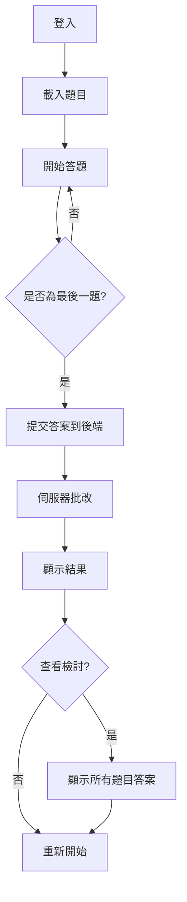

# 🎮 Vibe Game - 互動式問答遊戲

一個基於 React + Vite 的互動式問答遊戲，支援伺服器端批改、成績記錄、答題檢討等功能。

[](https://github.com/你的用戶名/vibe-game/actions)

## ✨ 功能特色

- 🎯 **考試模式** - 作答時不顯示對錯，全部答完後統一批改
- 🔐 **安全批改** - 答案儲存在後端，前端無法取得（防止作弊）
- 📊 **成績記錄** - 自動記錄每位玩家的遊玩歷史到 Google Sheets
- 📝 **答題檢討** - 遊戲結束後可查看所有題目的正確答案
- 🎨 **Pixel Art 風格** - 復古像素風格 UI 設計
- 📱 **響應式設計** - 支援桌面和移動設備
- ⚡ **快速載入** - 使用 Vite 建置，極速開發和生產環境
- 🔄 **自動部署** - 推送到 GitHub 自動部署到 GitHub Pages

---

## 🛠️ 技術棧

- **前端框架**: React 18
- **建置工具**: Vite
- **樣式**: CSS (Pixel Art 風格)
- **資料來源**: Google Sheets (CSV)
- **後端批改**: Google Apps Script
- **部署**: GitHub Actions + GitHub Pages

---

## 🚀 快速開始

### 前置需求

- Node.js >= 18
- npm 或 yarn
- Google 帳號（用於設定 Google Sheets 和 Apps Script）

### 1️⃣ 克隆專案

```bash
git clone https://github.com/你的用戶名/vibe-game.git
cd vibe-game
```

### 2️⃣ 安裝依賴

```bash
npm install
```

### 3️⃣ 設定環境變數

複製範例環境變數文件：

```bash
cp .env.example .env
```

編輯 `.env` 並填入你的設定：

```bash
# 題目 CSV URL（QuestionsPublic 工作表）
VITE_GOOGLE_SHEET_QUESTION_URL=你的CSV網址

# Google Apps Script 批改 API URL
VITE_GOOGLE_SHEET_RESPONSE_URL=你的AppsScript網址

# 遊戲設定
VITE_QUESTION_COUNT=5
VITE_PASS_THRESHOLD=3
```

### 4️⃣ 啟動開發伺服器

```bash
npm run dev
```

訪問 `http://localhost:5173` 開始遊玩！

---

## 📋 Google Sheets 設定

### Google Sheets 結構

你需要在 Google Sheets 中建立以下工作表：

#### 1. Questions（私有，含答案）

| 題號 | 題目 | A | B | C | D | 解答 |
|------|------|---|---|---|---|------|
| 1 | React 的核心概念是什麼？ | MVC | Component | Database | API | B |

- 用途：給 Google Apps Script 批改使用
- **不要公開**此工作表

#### 2. QuestionsPublic（公開 CSV，無答案）

| 題號 | 題目 | A | B | C | D |
|------|------|---|---|---|---|
| 1 | React 的核心概念是什麼？ | MVC | Component | Database | API |

- 用途：前端讀取題目
- 發布為 CSV：**檔案 → 共用 → 發布到網路 → CSV**

#### 3. Response（自動建立）

| 工號 | 闖關次數 | 總分 | 最高分 | 第一次通關分數 | 花了幾次通關 | 最近遊玩時間 |
|------|---------|------|--------|--------------|------------|-------------|

- 用途：記錄玩家成績
- 由 Google Apps Script 自動建立

---

## 🔧 Google Apps Script 設定

1. **複製程式碼**：將 `google-apps-script.js` 的內容複製到你的 Apps Script 編輯器
2. **部署**：
   - 點擊「部署」→「新增部署項目」
   - 選擇「網頁應用程式」
   - **執行身分**：我
   - **具有應用程式存取權的使用者**：**所有人**
   - 點擊「部署」
3. **複製 URL**：複製部署產生的網頁應用程式 URL

詳細說明請參考 [SETUP_GUIDE.md](./SETUP_GUIDE.md)

---

## 🌐 部署到 GitHub Pages

### 設定步驟

1. **設定 GitHub Secrets**：
   - 前往 `Settings → Secrets and variables → Actions`
   - 新增以下 Secrets：
     - `VITE_GOOGLE_SHEET_QUESTION_URL`
     - `VITE_GOOGLE_SHEET_RESPONSE_URL`

2. **啟用 GitHub Pages**：
   - 前往 `Settings → Pages`
   - Source 選擇 `GitHub Actions`

3. **推送程式碼**：
   ```bash
   git push origin main
   ```

部署完成後訪問：`https://你的用戶名.github.io/vibe-game/`

詳細說明請參考：
- [GITHUB_SECRETS.md](./GITHUB_SECRETS.md) - Secrets 設定教學
- [DEPLOYMENT.md](./DEPLOYMENT.md) - 部署完整指南

---

## 📁 專案結構

```
vibe-game/
├── .github/
│   └── workflows/
│       └── deploy.yml          # GitHub Actions 部署設定
├── src/
│   ├── components/             # React 元件
│   │   ├── LoginScreen.jsx     # 登入畫面
│   │   ├── GameScreen.jsx      # 遊戲畫面
│   │   ├── ResultScreen.jsx    # 結果畫面
│   │   ├── ReviewScreen.jsx    # 檢討畫面
│   │   └── LoadingScreen.jsx   # 載入動畫
│   ├── context/
│   │   └── GameContext.jsx     # 遊戲狀態管理
│   ├── services/
│   │   ├── googleSheetService.js  # Google Sheets API
│   │   └── diceBearService.js     # Avatar 生成
│   ├── App.jsx                 # 主應用程式
│   └── index.css              # 全域樣式
├── google-apps-script.js       # Google Apps Script 程式碼
├── .env.example               # 環境變數範例
├── .gitignore                 # Git 忽略文件
├── vite.config.js             # Vite 配置
└── package.json               # 專案依賴
```

---

## 🎮 遊戲流程



---

## 🔒 安全性設計

- ✅ 答案只存在後端 Google Apps Script 中
- ✅ 前端只讀取不含解答的 CSV
- ✅ 批改在伺服器端進行
- ✅ 環境變數不提交到 Git
- ✅ 使用 GitHub Secrets 保護敏感資訊

---

## 📚 相關文件

- [SETUP_GUIDE.md](./SETUP_GUIDE.md) - Google Sheets 和 Apps Script 設定指南
- [GITHUB_SECRETS.md](./GITHUB_SECRETS.md) - GitHub Secrets 設定教學
- [DEPLOYMENT.md](./DEPLOYMENT.md) - 部署完整指南

---

## 🤝 貢獻

歡迎提交 Issue 或 Pull Request！

---

## 📄 授權

MIT License

---

## 👨‍💻 作者

由 [Dean Lin](https://www.youtube.com/@dlcorner) 開發
